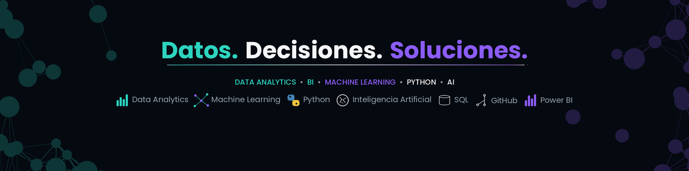

<div align="center">
  <a href="https://elena-diaz-beyond-the-resume.vercel.app/" target="_blank" rel="noopener noreferrer">
    
  </a>
</div>

---

<div align="center">

# 👋 Hola, soy Elena (Helen para los amigos)

[](https://www.linkedin.com/in/elena-diazmo)
[](https://github.com/HelenDiMo)

🌍 **Español · Nativo | Inglés · C1**

</div>

---

## 🧠 Sobre mí

Profesional con más de **13 años de experiencia en gestión, finanzas y operaciones**, actualmente orientando mi trayectoria hacia **Data Analysis, Inteligencia Artificial y desarrollo de soluciones digitales**.

Mi experiencia profesional aporta una perspectiva orientada a **procesos, resolución de problemas, comunicación interdepartamental y mejora continua**, que ahora combino con nuevas capacidades técnicas.

Me interesa especialmente el punto de encuentro entre **negocio, datos y tecnología**.

Exploro cómo la tecnología puede utilizarse para:

- 📊 Analizar y visualizar datos
- ⚙️ Automatizar procesos
- 🤖 Aplicar Inteligencia Artificial y Machine Learning
- 🔎 Transformar datos en información útil para la toma de decisiones
- 💡 Desarrollar soluciones digitales orientadas a problemas reales

---

## 🔄 From Business to Technology

<div align="center">

```
🏢 BUSINESS
Gestión · Finanzas · Operaciones
          │
          ▼
📊 DATA
Analysis · SQL · Power BI · EDA
          │
          ▼
🤖 AI
Machine Learning · IA · Automatización
          │
          ▼
💻 TECHNOLOGY
Python · Web · APIs · Digital Solutions
```

### **Business + Data + AI + Technology**

</div>

---

## 🛠️ Stack técnico

### 📊 Data & AI


### 📈 Visualization & Applications


### 🌐 Web Development


### 🚀 Backend, Testing & Containers


### 💻 Development & Environments


### 🏢 Business & ERP

`Business Central` · `Navision (Dynamics NAV)` · `Sage 50` · `ContaPlus` · `Microsoft Office`

---

## 🚀 Proyectos destacados

| 🏛️ **Archaios Data Intelligence** | 💼 **TinderJob** |
| :---: | :---: |
| _Data Analysis · EDA · Visualization_ | _Data Analysis · Python · Automation_ |
| Análisis y visualización de datos históricos para transformar información en conocimiento útil. | Proyecto de analítica avanzada y automatización orientado al análisis del mercado laboral tecnológico en España. |
| [**Ver proyecto →**](https://github.com/HelenDiMo/archaios-data-Intelligence) | [**Ver proyecto →**](https://github.com/HelenDiMo/TinderJob) |

---

## 📊 Actividad en GitHub

<div align="center">


</div>

</div>

---

## 🔭 Actualmente explorando

<div align="center">

|    📊 Data    |          🤖 AI          |   ⚙️ Automation    |     🌐 Web      |
| :-----------: | :---------------------: | :----------------: | :-------------: |
| Data Analysis | Artificial Intelligence | Process Automation | Web Development |
|      SQL      |    Machine Learning     |       Python       | React / Next.js |
|   Power BI    |     AI Applications     |        APIs        |   TypeScript    |

</div>

---

## 🎯 Mi enfoque

> **Business + Data + Technology**

Me interesa transformar **problemas de negocio en soluciones apoyadas en datos y tecnología**, combinando experiencia empresarial, pensamiento analítico y desarrollo técnico.

Busco seguir creciendo en roles relacionados con **Data, IA y tecnología**, aportando una perspectiva de negocio que me permita entender no solo cómo construir una solución, sino también **qué problema debe resolver y por qué**.

---

<details>
<summary>📚 Más sobre mi trayectoria</summary>

<br>

Mi trayectoria profesional comenzó en el ámbito de la **Administración, Finanzas y Operaciones**, trabajando con procesos, datos y sistemas ERP en entornos empresariales.

A lo largo de estos años he desarrollado una visión orientada a la **eficiencia, la resolución de problemas, la coordinación entre equipos y la mejora continua**.

Actualmente estoy trasladando esa experiencia al ámbito tecnológico mediante formación y proyectos prácticos en:

- Data Analysis
- Inteligencia Artificial
- Python
- SQL
- Machine Learning
- Desarrollo Web
- Automatización

Esta combinación me permite abordar los problemas desde una perspectiva que conecta **necesidades reales de negocio con soluciones tecnológicas**.

</details>

---

<div align="center">

## 🤝 ¿Hablamos?

Siempre estoy abierta a conectar, compartir ideas y explorar nuevas oportunidades.

[](https://www.linkedin.com/in/elena-diazmo)
<br>
[](mailto:elena.diazmoreno@gmail.com)

</div>
